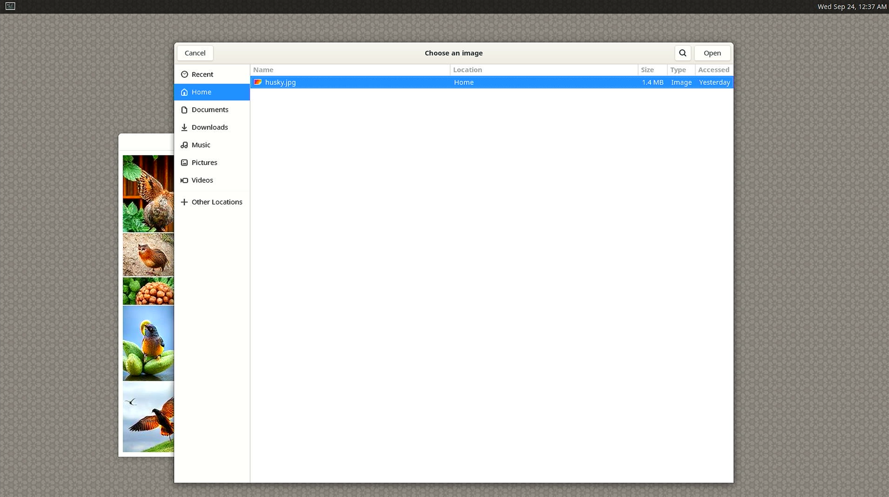

# 🧠 Image Classification with LiteRT

This sample Python application demonstrates how to deploy and run a classification model on Qualcomm's RB3 Gen2 and Rubik Pi development platforms using LiteRT. These platforms are designed to accelerate computing and connectivity for consumer and industrial IoT (Internet of Things) devices.

The application is compatible with both Ubuntu 22.04 and Qualcomm Linux 1.4. It provides a graphical interface that allows users to:
- Select an image
- Choose between CPU and Delegate inference modes
- Run inference using a classification model
- View the top 4 predictions with confidence bars
- Reprocess images with different inference settings

The model used is a quantized GoogLeNet implemented with LiteRT (previously known as TFLite).

---

# 📱 Hardware

   ✅ RB3 Gen 2
   ✅ Rubik Pi

---

## 🖥️ Requirements

### RB3 Gen2 Device
Follow RB3 Gen2 vision kit set up [instructions](https://docs.qualcomm.com/bundle/publicresource/topics/80-70020-251/set_up_the_device.html?product=1601111740013077&facet=User%20Guide) 

### Rubik Pi Device
Follow Rubik Pi set up [instructions](https://www.thundercomm.com/rubik-pi-3/en/docs/about-rubikpi/)

### Classification Model and Labels
Download:
- TFLite GoogLeNet-Quantized model from [AIHub](https://aihub.qualcomm.com/models/googlenet?domain=Computer+Vision&useCase=Image+Classification)
- Imagenet dataset [labels](https://github.com/quic/ai-hub-models/blob/main/qai_hub_models/labels/imagenet_labels.txt)

---

## 🎮 Platform OS Setup:

### Ubuntu:
Clone the project directly on your Hardware
   ```bash
   git clone https://github.com/cyberZil/litert-pygui-classification.git
   cd litert-pygui-classification

   # Set up Python virtual environment
   sudo apt install python3.12-venv
   python3 -m venv .venv-litert-demo --system-site-packages
   source .venv-litert-demo/bin/activate
   
   # Install LiteRT and other dependencies
   pip3 install ai-edge-litert==1.3.0
   ```

### Qualcomm Linux:
Clone repository on your host machine and push files to your device:
   ```bash
   adb push litert-pygui-classification /opt
   ```

---

## 📁 File Structure on Device
```
main.py                    # Main application script
qliFunctions.py            # OS detection and Qualcomm Linux specific functions
googlenet_quantized.tflite # TFLite model file (required)
imagenet_labels.txt        # Label file (required)
MainWindowPic.jpg          # Default image
```

---

## 🚀 How to Run App
After going to the folder where you cloned the repo or /opt for Qualcomm Linux run the following command
   ```bash
   python3 main.py
   ```
Output
 
---

## 📺 Use GUI and expected output

  - Click **"Select Image"** to choose an image file.
    
  - The image will be displayed and classified with the top 4 predictions.
    
  - Select between **CPU** and **Delegate** inference modes using the radio buttons.
  - Click **"Reprocess Image"** to run inference again with different settings.

---

## 🔍 Platform Detection

The application automatically detects whether it's running on Ubuntu or Qualcomm Linux:
- On Ubuntu, it uses the ai-edge-litert Python package
- On Qualcomm Linux, it uses the native libtensorflowlite_c.so library with ctypes

This allows the same application to run efficiently on both platforms with optimized performance.

---
