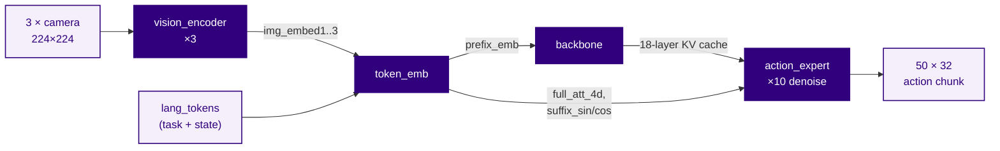
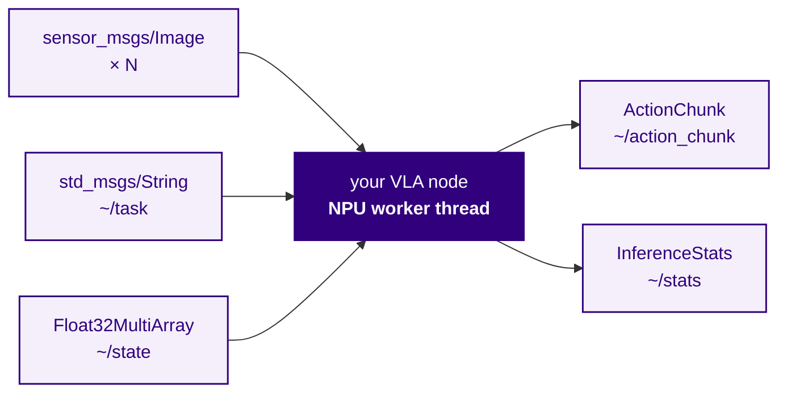

Build up a vision-language-action model on a Qualcomm Dragonwing IQ-9075 EVK, one step at a time, until it generates robot motion on the board's Hexagon NPUs. Everything here is self-contained — every command and every line of code you need is on this page, and each step ends in output you can check against.

We use [Pi0.5](https://aihub.qualcomm.com/models/pi05), a 3-billion-parameter robot foundation model: give it camera images and a plain-English instruction, and it outputs joint motion. The first NPU inference takes about ten minutes to reach. The last third of the page is the interesting part — *why* the four pieces of this model end up distributed across the hardware the way they do.

<Note>
  Every number on this page was measured on a real IQ-9075 EVK running Ubuntu 24.04 Server. Figures taken from Qualcomm AI Hub's own published profiling are labelled as such and never blended with ours.
</Note>

## What you will end up with

| | Measured |
| --- | --- |
| Action chunk (50 timesteps × 7 DoF) | **1128 ms** sustained (3153 chunks over 90 min); single bench runs span 1111–1152 |
| Speed against real time | **~4.4×** — LIBERO runs at 10 Hz, so 50 steps is 5 s of motion |
| Correctness | **45 of 45 output tensors bitwise identical** to Qualcomm's reference runner |
| Task success, closed loop | **86 of 100 episodes** across all ten LIBERO-10 tasks, driving a simulator on the same board |
| CPU fallback | none; 100% NPU |

## Before you start

| Requirement | Notes |
| --- | --- |
| Dragonwing IQ-9075 EVK | Booting Ubuntu 24.04 Server or newer, arm64. Headless is fine — nothing here needs a display |
| ~35 GB free disk | The model is 2.9 GB; builds and dumps account for the rest |
| Network | About 3 GB of downloads |
| Qualcomm AI Hub access | Required for `qai-hub-models fetch Pi0.5`; no live compile job or browser is required |

Set a working directory that the rest of the page refers to:

```bash theme={null}
export WORK=$HOME/pi05
mkdir -p $WORK && cd $WORK
```

## 1. Install ROS 2 Jazzy and the Qualcomm AI runtime

Start with ROS 2. These are the commands from the [Software Setup](/Ubuntu/robotics-workflows/software-setup) page:

```bash theme={null}
sudo apt-get update
sudo apt-get install -y curl gnupg2 lsb-release ca-certificates software-properties-common locales
sudo locale-gen en_US en_US.UTF-8
sudo add-apt-repository universe -y
sudo curl -sSL https://raw.githubusercontent.com/ros/rosdistro/master/ros.key \
  -o /usr/share/keyrings/ros-archive-keyring.gpg
echo "deb [arch=$(dpkg --print-architecture) signed-by=/usr/share/keyrings/ros-archive-keyring.gpg] \
http://packages.ros.org/ros2/ubuntu $(. /etc/os-release && echo $UBUNTU_CODENAME) main" \
  | sudo tee /etc/apt/sources.list.d/ros2.list > /dev/null
sudo apt-get update
sudo apt-get install -y ros-jazzy-ros-base python3-colcon-common-extensions ros-dev-tools
```

<Warning>
  **`http://`, not `https://`, is deliberate.** `packages.ros.org` is a CNAME to `ftp.osuosl.org`, whose TLS certificate covers only `*.osuosl.org`. On networks where no CDN papers over that mismatch, `https://` fails certificate verification. Package integrity comes from the GPG signature, which is what `apt` actually verifies — the official Qualcomm setup page uses `http://` for the same reason.
</Warning>

Now the Qualcomm AI Runtime (QAIRT), which contains the QNN libraries that talk to the Hexagon NPU:

```bash theme={null}
sudo apt-get install -y qairt-libs qairt-tools qairt-headers
```

<Note>
  `ppa:ubuntu-qcom-iot/qcom-ppa` is **already present on the stock IQ-9075 image**, so you do not need to add it. Adding it a second time produces a fatal `E: Conflicting values set for option Trusted`. If you hit that, list `/etc/apt/sources.list.d/` and delete the duplicate.
</Note>

Confirm the NPU is reachable and you have the right Hexagon architecture. The IQ-9075 is **v73**:

```bash theme={null}
ls /dev/fastrpc-cdsp /dev/fastrpc-cdsp1
ls /usr/lib/libQnnHtpV73Stub.so
```

**Expected output:**

```
/dev/fastrpc-cdsp  /dev/fastrpc-cdsp1
/usr/lib/libQnnHtpV73Stub.so
```

Note that there are **two** CDSP device nodes. Hold that thought — it becomes the whole story later.

<Tip>
  Inference works as a normal user; you do not need root. If you get permission errors on `/dev/fastrpc-cdsp`, add yourself to the `fastrpc` group with `sudo usermod -aG fastrpc $(id -un)` and log out and back in.
</Tip>

## 2. Get Pi0.5 without an AI Hub account

Most AI Hub models require a per-user cloud compile job. Pi0.5 publishes **prebuilt QNN context binaries** for `qualcomm-qcs9075`, and the IQ-9075 EVK is its `default_device` — so this is a plain HTTPS download:

```bash theme={null}
pip install --user qai-hub-models
cd $WORK
qai-hub-models fetch Pi0.5 --runtime qnn_context_binary --precision mixed --chipset qualcomm-qcs9075
export BUNDLE=$WORK/pi05-qnn_context_binary-mixed-qualcomm_qcs9075
ls -l $BUNDLE
```

**Expected output** — four `.bin` files and a metadata file, 2.9 GB in total:

```
action_expert.bin     439205888
backbone.bin          979836928
metadata.json             25536
token_emb.bin        1055449088
vision_encoder.bin    540233728
```

**Pi0.5 is not one model — it is four.** That shapes everything that follows:

| Component | MiB | What it does |
| --- | --: | --- |
| `vision_encoder.bin` | 515 | Turns one camera image into 256 embedding tokens |
| `token_emb.bin` | 1007 | Embeds language tokens, builds attention masks and RoPE tables |
| `backbone.bin` | 934 | The language model prefill; emits an 18-layer KV cache |
| `action_expert.bin` | 419 | Denoises a noisy action chunk into a real one |

Quantization is mixed: w4a16 backbone, w8a16 vision encoder and action expert.

<Note>
  The bundle records `SDK build=v2.45.0.260326154327`. It runs unmodified on QAIRT **2.46.0** from apt, so you do not need to match SDK versions exactly.
</Note>

## 3. Run your first piece of the model on the NPU

Before writing any code, prove the hardware works using `qnn-net-run`, which ships with `qairt-tools`.

The vision encoder takes one RGB image, 224×224, channels-first, float32, normalized to [-1, 1]. Make one:

```bash theme={null}
mkdir -p $WORK/run && cd $WORK/run
python3 -c "
import numpy as np
np.random.seed(0)
np.random.uniform(-1, 1, (1, 3, 224, 224)).astype('float32').tofile('image.raw')
open('input_list.txt', 'w').write('image:=image.raw\n')
"
qnn-net-run --backend /usr/lib/libQnnHtp.so \
  --retrieve_context $BUNDLE/vision_encoder.bin \
  --input_list input_list.txt --output_dir out
```

**Expected output** ends with:

```
Executing Graphs
Finished Executing Graphs
```

And you have a real tensor:

```bash theme={null}
ls -l out/Result_0/img_embed.raw
```

**Expected output:** `2097152` bytes — exactly `1 × 256 × 2048` float32 values.

**That is a slice of a 3-billion-parameter model running on the Hexagon NPU.** `--backend /usr/lib/libQnnHtp.so` is what put it there; swap in `libQnnCpu.so` and the identical command runs on the CPU instead. That one string is the whole difference.

## 4. Find out what you actually have to wire up

You now have four models and no idea how they connect. Do not guess, and do not trust `metadata.json`'s key order — ask the binaries themselves. `qnn-context-binary-utility` dumps a context binary's declared inputs and outputs, **in the order the compiled graph expects them**:

```bash theme={null}
cd $WORK/run
for m in vision_encoder token_emb backbone action_expert; do
  qnn-context-binary-utility --context_binary=$BUNDLE/$m.bin --json_file=$m.json >/dev/null 2>&1
done
```

Then print the graph order:

```bash theme={null}
python3 - <<'PY'
import json
for m in ("vision_encoder", "token_emb", "backbone", "action_expert"):
    info = json.load(open(f"{m}.json"))["info"]["graphs"][0]["info"]
    print(f"\n=== {m} ===")
    for kind in ("graphInputs", "graphOutputs"):
        names = [t["info"]["name"] for t in info.get(kind) or []]
        print(f"  {kind} ({len(names)}):")
        print("   ", ", ".join(names))
PY
```

**Expected output** (abridged — `action_expert` has 41 inputs):

```
=== vision_encoder ===
  graphInputs (1):   image
  graphOutputs (1):  img_embed

=== token_emb ===
  graphInputs (5):   lang_tokens, img_embed1, img_embed2, img_embed3, lang_mask
  graphOutputs (7):  prefix_emb, prefix_att_2d, prefix_sin, prefix_cos, suffix_sin, suffix_cos, full_att_4d

=== backbone ===
  graphInputs (4):   prefix_att_2d_masks, hidden_state, rope_emb_cos, rope_emb_sin
  graphOutputs (36): k_cache_l0, k_cache_l1, ... k_cache_l17, v_cache_l0, ... v_cache_l17

=== action_expert ===
  graphInputs (41):  x_t, time_step, key_cache_l0, key_cache_l1, key_cache_l10, key_cache_l11,
                     ... key_cache_l17, key_cache_l2, ... key_cache_l9, value_cache_l0, ...,
                     rope_emb_cos, rope_emb_sin, full_att_4d
  graphOutputs (1):  action_emb
```

**Read `action_expert`'s input order again.** It is `l0, l1, l10, l11 … l17, l2, l3 … l9` — string-sorted, not numeric. The `backbone` that produces those caches emits them as `l0, l1, l2 … l17`. Wire them up in producer order and you silently scramble 12 of 18 layers. Nothing errors. The model runs. The actions are garbage.

This is why you generate the ordering from the binaries rather than typing it out.

## How the pipeline fits together



One action chunk is **15 NPU invocations**: three vision passes (one per camera slot), one token embedding, one backbone prefill, then ten denoising steps through the action expert. Constants worth knowing:

| Constant | Value | Where it comes from |
| --- | --- | --- |
| Cameras | 3 | 2 real + 1 `empty_cameras` slot; zero-fill the unused one |
| Language tokens | 200 | Right-padded with id 0 |
| `src_len` | 968 | `256 × 3 cameras + 200 tokens` |
| Action chunk | 50 × 32 | 32 is max action dim; real DoF is a prefix (7 for a Franka) |
| Denoise steps | 10 | `num_inference_steps` in the policy config |

Two renames to watch, on top of the ordering trap: `token_emb` emits `prefix_emb` but `backbone` calls it `hidden_state`, and `prefix_att_2d` becomes `prefix_att_2d_masks`. `suffix_sin`/`suffix_cos` arrive at the action expert as `rope_emb_sin`/`rope_emb_cos`.

## Where the robot's state goes

There is no state input tensor anywhere in those four graphs. Pi0.5 discretizes proprioception into 256 buckets and splices it into the **language prompt**. This is the format, reproduced from the upstream [openpi](https://github.com/Physical-Intelligence/openpi) implementation:

```python theme={null}
cleaned = prompt.strip().replace("_", " ").replace("\n", " ")
discretized = np.digitize(state, np.linspace(-1, 1, 257)[:-1]) - 1
full = f"Task: {cleaned}, State: {' '.join(map(str, discretized))};\nAction: "
tokens = tokenizer.encode(full, add_bos=True)   # right-pad with 0 to 200
```

So the prompt — and therefore the token ids — change on **every control step**. You cannot precompute a lookup table of tokenized instructions and use it in a closed loop; the tokenizer has to run inline.

The tokenizer is the standard PaliGemma SentencePiece model. `google/paligemma-3b-pt-224` on Hugging Face is gated (HTTP 401 without an accepted licence), but the identical file is served unauthenticated from Google's `big_vision` bucket — which is where openpi fetches it too:

```bash theme={null}
cd $WORK
curl -fSL -o paligemma_tokenizer.model \
  https://storage.googleapis.com/big_vision/paligemma_tokenizer.model
sha256sum paligemma_tokenizer.model
```

**Expected output:** `8986bb4f423f07f8c7f70d0dbe3526fb2316056c17bae71b1ea975e77a168fc6`.

Generate the token ids for a task, with a state vector folded in:

```bash theme={null}
pip install --user sentencepiece
cd $WORK/run
python3 - <<'PY'
import numpy as np, sentencepiece as spm
sp = spm.SentencePieceProcessor(model_file="../paligemma_tokenizer.model")
state = np.array([0.1, -0.2, 0.3, 0.0, 0.5, -0.9, 0.25, 0.0], dtype=np.float32)
bins = np.digitize(state, np.linspace(-1, 1, 257)[:-1]) - 1
prompt = f"Task: pick up the black bowl, State: {' '.join(map(str, bins))};\nAction: "
ids = sp.encode(prompt, add_bos=True)
print(f"{len(ids)} tokens:", ids[:12], "...")
tokens = np.zeros(200, dtype=np.int32); tokens[:len(ids)] = ids
mask = np.zeros(200, dtype=np.float32); mask[:len(ids)] = 1.0
tokens.tofile("lang_tokens.raw"); mask.tofile("lang_mask.raw")
PY
```

**Expected output:**

```
47 tokens: [2, 7071, 235292, 4788, 908, 573, 2656, 14581, 235269, 3040, 235292, 235248] ...
```

<Warning>
  If you feed these to `qnn-net-run`, you **must** pass `--use_native_input_files`. By default it parses every input file as float32 and casts to the graph's dtype. For int32 `lang_tokens` that turns real token ids into zeros — i.e. all padding — and the model then silently conditions on nothing. The symptom is subtle: output that differs only in the rows corresponding to real language tokens, whose values equal the padding embedding.
</Warning>

## 5. Run a model from your own code

`qnn-net-run` is a test harness; it reads files and writes files. To chain four models you need them in one process. The QRB ROS package that does this is `qrb_inference_manager`, and its entire API is three calls.

Install it, plus the ROS node that wraps it:

```bash theme={null}
sudo add-apt-repository -y ppa:ubuntu-qcom-iot/qirp
sudo apt-get update
sudo apt-get install -y ros-jazzy-qrb-ros-nn-inference libsentencepiece-dev
```

<Warning>
  **The apt version cannot run this model.** `ros-jazzy-qrb-inference-manager` in apt is 1.1.1; upstream is 2.2.0. Version 1.1.1 rejects **int32** tensor inputs, which is exactly what `token_emb` takes for `lang_tokens`. We install it here for the headers and to see the API, then build from source in step 8 — which you need anyway.
</Warning>

Write this file as `$WORK/minimal_npu.cpp`. It is the complete program:

```cpp theme={null}
// The entire QRB ROS NPU API: construct, execute, read.
#include <cstdint>
#include <cstdio>
#include <cstring>
#include <string>
#include <vector>

#include "qrb_inference_manager.hpp"

int main(int argc, char ** argv)
{
  if (argc < 2) { std::fprintf(stderr, "usage: minimal_npu <model.bin>\n"); return 2; }

  // vision_encoder wants one RGB image, 224x224, CHW, float32, in [-1, 1].
  constexpr int kElems = 3 * 224 * 224;
  std::vector<float> image(kElems, 0.5F);          // flat grey is enough to prove it runs
  std::vector<uint8_t> input(image.size() * sizeof(float));
  std::memcpy(input.data(), image.data(), input.size());

  // 1. load onto the NPU. "libQnnHtp.so" is what selects the Hexagon;
  //    "libQnnCpu.so" would run the same graph on the CPU.
  qrb::inference_mgr::QrbInferenceManager mgr(argv[1], "libQnnHtp.so");

  // 2. run it. inference_execute() takes ONE flat buffer and slices it across
  //    the graph's inputs in compiled graph order.
  if (!mgr.inference_execute(input)) { std::fprintf(stderr, "execute failed\n"); return 1; }

  // 3. read the results back.
  for (const auto & t : mgr.get_output_tensors()) {
    std::printf("%s: %zu bytes, shape [", t.output_tensor_name.c_str(),
                t.output_tensor_data.size());
    for (size_t i = 0; i < t.output_tensor_shape.size(); ++i)
      std::printf("%s%u", i ? ", " : "", t.output_tensor_shape[i]);
    const auto * v = reinterpret_cast<const float *>(t.output_tensor_data.data());
    std::printf("]  first values: %.4f %.4f %.4f\n", v[0], v[1], v[2]);
  }
  return 0;
}
```

Build and run it — one `g++` line, no CMake:

```bash theme={null}
cd $WORK
g++ -std=c++17 -O2 -I/opt/ros/jazzy/include minimal_npu.cpp \
  -L/opt/ros/jazzy/lib -lqrb_inference_manager \
  -Wl,-rpath,/opt/ros/jazzy/lib -o minimal_npu
QNN_HTP_BURST=1 ./minimal_npu $BUNDLE/vision_encoder.bin
```

**Expected output:**

```
img_embed: 2097152 bytes, shape [1, 256, 2048]  first values: 6.9219 -0.7668 -0.6043
```

Three API calls to put a 3-billion-parameter model's vision encoder on an NPU. There is no session setup, no delegate registration, no graph builder, and no device management to write.

<Tip>
  `QNN_HTP_BURST=1` locks the HTP to its TURBO performance level. Without it the NPU runs at a default DCVS setting and every stage is measurably slower. It is read at context creation, so it must be in the environment before the process starts.
</Tip>

## 6. Chain the four models

This is the part you write yourself, and it is mostly bookkeeping. The shape of it:

```cpp theme={null}
// Per action chunk, in order:
//
//  1. for cam in 0..2:  vision_encoder(image[cam])        -> img_embed[cam]
//     (zero-fill any camera slot you do not have; the graph arity is fixed at 3)
//
//  2. token_emb(lang_tokens, img_embed[0..2], lang_mask)
//       -> prefix_emb, prefix_att_2d, prefix_sin, prefix_cos,
//          suffix_sin, suffix_cos, full_att_4d
//
//  3. backbone(prefix_att_2d      -> prefix_att_2d_masks,
//              prefix_emb         -> hidden_state,
//              prefix_cos         -> rope_emb_cos,
//              prefix_sin         -> rope_emb_sin)
//       -> k_cache_l0..17, v_cache_l0..17          (each [1, 968, 1, 256])
//
//  4. x_t = gaussian noise, shape [1, 50, 32];  t = 1.0;  dt = -1.0 / 10
//     repeat 10 times:
//       action_expert(x_t, t,
//                     k_cache_l*  -> key_cache_l*     IN LEXICOGRAPHIC ORDER,
//                     v_cache_l*  -> value_cache_l*   IN LEXICOGRAPHIC ORDER,
//                     suffix_cos  -> rope_emb_cos,
//                     suffix_sin  -> rope_emb_sin,
//                     full_att_4d -> full_att_4d)
//         -> action_emb            // already the Euler-updated x_{t+dt}
//       x_t = action_emb;  t += dt
//
//  5. x_t is your action chunk: 50 timesteps x 32 dims. The real degrees of
//     freedom are the first `action_dof` columns (7 for a Franka Panda);
//     everything after that is padding and must be ignored.
```

Two implementation notes that save real time:

- **Everything except `x_t` and `time_step` is constant across the ten denoise steps.** Pack the ~34 MB of KV cache into the expert's input buffer once, then rewrite only 6404 bytes per step.
- **The expert returns `x_{t+dt}` directly.** It applies the Euler update internally, so there is no host-side `x += dt * v`.

Build the flat input buffer for each stage by concatenating tensors in the graph order you dumped in step 4 — that is the contract `inference_execute()` enforces, and it will tell you if the total size is wrong:

```
Total size of all input tensors should be 35945556 bytes, but receive 35945552 bytes
```

## 7. Hit the wall: one NPU cannot hold Pi0.5

With all four contexts constructed in one process, you get this:

```text theme={null}
fastrpc memory map for fd: 39 with length: 434110464 failed with error: 0x1
SharedMemoryMod failed to Map Buffer to SMMU for domain 0
Failed to map weights buffer to device!
Failed to initialize graph with id 256 context 4 deviceId 0 ... with err 1002
```

The four binaries hold **2875 MiB** of weights. This is **DSP address space, not host RAM** — it fails with 34 GB of system memory free, as root, and each binary loads perfectly well on its own. Measured on device 0:

| Peak concurrently-mapped weights | Result |
| --: | --- |
| 1523 MiB | clean |
| 1941 MiB | `Failed to map buffer` |
| 2875 MiB (all four) | hard failure |

It is not a clean volume limit either: repeated map/unmap fragments the address space, so identical totals succeed or fail depending on what the process did earlier.

<Warning>
  **A context whose weights fail to map still reports success.** You get `Initialize Qnn graph from binary file successfully` in the log, and the handle it hands back produces a garbage-length output vector — which surfaces much later as a memory error in your own code. Defend against it: compare the number of output tensors you got against the number the graph declared in step 4, and treat any mismatch as a hard error.
</Warning>

The obvious workaround is to create and destroy contexts around each use. It works, and it is slow — weight loading dominates:

| Configuration | ms/chunk | of which weight paging |
| --- | --: | --: |
| Page every context in and out | 4421 | ~3245 |
| Keep only `vision_encoder` resident | 3277 | ~2258 |

Two thirds of your time is spent not computing.

## 8. Unlock the second NPU

Remember the two device nodes from step 1. The question is whether QNN will let you *target* them. Ask it directly — write `$WORK/devices.cpp`:

```cpp theme={null}
#include <dlfcn.h>
#include <cstdint>
#include <cstdio>
#include "QnnDevice.h"
#include "QnnInterface.h"

int main()
{
  void * lib = dlopen("libQnnHtp.so", RTLD_NOW);
  auto get = reinterpret_cast<Qnn_ErrorHandle_t (*)(const QnnInterface_t ***, uint32_t *)>(
      dlsym(lib, "QnnInterface_getProviders"));
  const QnnInterface_t ** providers = nullptr;
  uint32_t n = 0;
  get(&providers, &n);
  const auto & api = providers[0]->QNN_INTERFACE_VER_NAME;

  const QnnDevice_PlatformInfo_t * info = nullptr;
  api.deviceGetPlatformInfo(nullptr, &info);
  std::printf("hardware devices: %u\n", info->v1.numHwDevices);
  for (uint32_t i = 0; i < info->v1.numHwDevices; ++i)
    std::printf("  device[%u] id=%u numCores=%u\n", i,
                info->v1.hwDevices[i].v1.deviceId, info->v1.hwDevices[i].v1.numCores);
  api.deviceFreePlatformInfo(nullptr, info);
  return 0;
}
```

```bash theme={null}
cd $WORK
g++ -std=c++17 -O2 -I/usr/include/QNN devices.cpp -ldl -o devices && ./devices
```

**Expected output:**

```
hardware devices: 2
  device[0] id=0 numCores=1
  device[1] id=1 numCores=1
```

**Two addressable HTP devices, each with its own mapping budget.** Split the four contexts across both and all of them stay resident — the paging problem disappears entirely.

There is one obstacle: `qrb_inference_manager` calls `deviceCreate(nullptr, nullptr, …)`, which always lands on device 0. Selecting a device means handing it a single-entry `QnnDevice_PlatformInfo_t`. Build the library from source and add it:

```bash theme={null}
mkdir -p $WORK/ws/src && cd $WORK/ws/src
git clone https://github.com/qualcomm-qrb-ros/qrb_ros_nn_inference.git
```

Building from source is required regardless — it is what gets you int32 support (`token_emb`), multi-input tensors, and HTP burst mode, none of which are in the apt 1.1.1 release.

In `qrb_ros_nn_inference/qrb_inference_manager/src/qnn_inference/qnn_inference.cpp`, find `create_device()` and replace the `deviceCreate` call with this:

```cpp theme={null}
// Scope this device handle -- and therefore every context created from it -- to
// one HTP core. device_id_ is a new member, plumbed in from the constructor.
QnnDevice_CoreInfo_t core = QNN_DEVICE_CORE_INFO_INIT;
QnnDevice_HardwareDeviceInfo_t hw = QNN_DEVICE_HARDWARE_DEVICE_INFO_INIT;
QnnDevice_PlatformInfo_t platform = QNN_DEVICE_PLATFORM_INFO_INIT;
QnnDevice_Config_t cfg = QNN_DEVICE_CONFIG_INIT;
const QnnDevice_Config_t * cfgs[] = { &cfg, nullptr };
const QnnDevice_Config_t ** configs = nullptr;

if (device_id_ != 0) {
  core.v1.coreId = 0;
  core.v1.coreType = 0;
  hw.v1.deviceId = device_id_;
  hw.v1.deviceType = 0;              // QNN_HTP_DEVICE_TYPE_ON_CHIP
  hw.v1.numCores = 1;
  hw.v1.cores = &core;
  platform.v1.numHwDevices = 1;
  platform.v1.hwDevices = &hw;
  cfg.option = QNN_DEVICE_CONFIG_OPTION_PLATFORM_INFO;
  cfg.hardwareInfo = &platform;
  configs = cfgs;                    // nullptr keeps upstream behaviour: device 0
}

auto qnn_status = qnn_interface_->interface_.deviceCreate(nullptr, configs, &(device_handle_));
```

Add a `const uint32_t device_id_ = 0;` member and a `device_id` constructor parameter on both `QnnInference` and `QrbInferenceManager`, then build:

```bash theme={null}
cd $WORK/ws
source /opt/ros/jazzy/setup.bash
colcon build --packages-select qrb_inference_manager --cmake-args -DCMAKE_BUILD_TYPE=Release
```

<Warning>
  **`OutputTensor` is an ABI break between apt 1.1.1 and upstream.** Upstream added four DMA-buf fields, changing `sizeof(OutputTensor)`. Anything compiled against the apt headers but linked against the rebuilt library reads `std::vector<OutputTensor>` at the wrong stride and crashes in `std::bad_array_new_length`. Your include path for the overlay must come **before** `/opt/ros/jazzy/include`, and dependent code needs a clean rebuild rather than a relink.
</Warning>

Now construct each of the four managers with an explicit device id and keep all four resident.

## Why we split things the way we did

With both NPUs available there are several ways to distribute four models. The obvious one is to balance by size — put roughly 1.4 GB on each device. That is not the best answer.

<Frame caption="Placement of Pi0.5's four components across the IQ-9075's two Hexagon NPUs, drawn to measured latency. One NPU pays 2258 ms of weight paging (3277 ms total). Two NPUs keep everything resident (1323 ms). Re-placing the expensive stages onto the faster NPU — same bytes per device — reaches 1111 ms.">
  <video src="/assets/npu-scheduling.mp4" poster="/assets/npu-scheduling-poster.png" controls muted loop playsInline />
</Frame>

The animation makes one thing visible that a static diagram cannot: **the four stages are sequentially dependent.** `vision_encoder` feeds `token_emb`, which feeds `backbone`, which feeds `action_expert`. Nothing runs concurrently. Spreading the model across two NPUs does not parallelise anything — it just means every component can stay mapped, so the chain stops paying to swap weights in and out. That is where the first and largest win comes from.

Start from what the components cost, measured per action chunk:

| Component | Calls/chunk | Weights | Cost on device 0 | Cost on device 1 |
| --- | --: | --: | --: | --: |
| `vision_encoder` | 3 | 515 MiB | 140 ms | 194 ms |
| `token_emb` | 1 | 1007 MiB | 22 ms | 26 ms |
| `backbone` | 1 | 934 MiB | 509 ms | 656 ms |
| `action_expert` | 10 | 419 MiB | 379 ms | 483 ms |

**The two NPUs are not equally fast.** Every component runs 25–30% slower on device 1 than on device 0. We measured this repeatedly and consistently; we do not have a confirmed cause, and we are not going to speculate about one.

That asymmetry decides the placement. `backbone` and `action_expert` together are ~888 ms of the ~1030 ms of compute — so they belong on the fast device, and the two cheap components go on the slow one. **Balance by cost, not by size:**

| Split (vision, token_emb, backbone, expert) | Resident per device | ms/chunk |
| --- | --- | --: |
| `0,0,1,1` — balanced by size | 1522 / 1353 MiB | 1323 |
| `1,0,1,0` | 1449 / 1426 MiB | 1258 |
| **`1,1,0,0` — balanced by cost** | **1522 / 1353 MiB** | **1111** |

Note that the first and last rows put the *same number of bytes* on each device. The 212 ms between them comes purely from which device does the expensive work.

The end state, measured over 12 iterations after 3 warmup:

| Stage | Calls | mean ms | p95 ms | Device |
| --- | --: | --: | --: | --- |
| `vision_encoder` | 3 | 193.25 | 194.07 | 1 |
| `token_emb` | 1 | 22.48 | 23.18 | 1 |
| `backbone` | 1 | 509.32 | 510.39 | 0 |
| `action_expert` | 10 | 379.26 | 382.17 | 0 |
| host tensor packing | — | 6.24 | 6.58 | CPU |
| context create/free | — | **0.00** | **0.00** | — |
| **total per chunk** | | **1110.73** | **1113.49** | |

Context paging is now exactly zero, and the whole pipeline is **4× faster than the single-NPU path** it started from — from 4421 ms down to 1111 ms.

<Warning>
  **Do not trust a single benchmark run on this board — the spread is ~30 ms.** Five consecutive runs on an idle board gave 1120.5, 1147.9, 1127.6, 1150.8 and 1146.5 ms: mean 1138.7, stdev 13.6, and the coolest run was the fastest (die temperature correlated +0.71 with latency). The 1111 ms above does not reproduce; it sits below all five. It was not wrong when measured, but it is the optimistic tail rather than the centre. The figure worth quoting is the sustained one — **1128.1 ms averaged over 3153 chunks and 90 minutes** of closed-loop operation — because it is a vastly larger sample on a thermally settled board. If you benchmark your own board, report the spread and the die temperature, not one number.
</Warning>

### How that compares to AI Hub's published figures

AI Hub profiles each component **in isolation**. We run the whole chain with host-side marshalling between stages, so ours are necessarily higher. This is a like-for-unlike comparison, shown to locate the overhead rather than to claim a win:

| Component | AI Hub published × calls | Ours, in-pipeline |
| --- | --: | --: |
| `vision_encoder` | 40.68 × 3 = 122.0 ms | 193.25 ms |
| `token_emb` | 4.24 × 1 = 4.2 ms | 22.48 ms |
| `backbone` | 397.27 × 1 = 397.3 ms | 509.32 ms |
| `action_expert` | 36.43 × 10 = 364.3 ms | 379.26 ms |
| **total** | **887.8 ms** | **1110.73 ms** |

The ~223 ms gap is dominated by moving tensors between stages on the CPU. `backbone` alone emits 36 KV tensors totalling ~34 MB that have to be read out and repacked into the expert's input buffer. That is the obvious next target, and [`qrb_ros_transport`](/Ubuntu/robotics-workflows/qrb-ros-transport) DMA-buf fd passing is the mechanism — `qrb_inference_manager` 2.x already exposes an `inference_execute_dmabuf()` entry point for it.

## 9. Prove it is numerically correct

Fast and wrong is easy to build here — a scrambled KV cache produces confident, plausible, useless actions. So check against the reference implementation you already used in step 3.

Dump each stage's exact flat input buffer and its outputs from your chained pipeline, split the input back into per-tensor files using the graph order from step 4, replay them through `qnn-net-run`, and diff:

```bash theme={null}
# for one component, given <comp>_IN.raw written by your pipeline:
python3 - <<'PY'
import json, pathlib
comp = "backbone"
info = json.load(open(f"{comp}.json"))["info"]["graphs"][0]["info"]
SZ = {"QNN_DATATYPE_FLOAT_32": 4, "QNN_DATATYPE_INT_32": 4}
blob = pathlib.Path(f"{comp}_IN.raw").read_bytes()
off, entries = 0, []
for t in info["graphInputs"]:
    ti = t["info"]
    n = SZ[ti["dataType"]]
    for d in ti["dimensions"]:
        n *= d
    pathlib.Path(f"{ti['name']}.raw").write_bytes(blob[off:off + n])
    off += n
    entries.append(f"{ti['name']}:={ti['name']}.raw")
pathlib.Path("list.txt").write_text(" ".join(entries) + "\n")
print(f"split {off} bytes into {len(entries)} tensors")
PY

qnn-net-run --backend /usr/lib/libQnnHtp.so --retrieve_context $BUNDLE/backbone.bin \
  --input_list list.txt --output_dir ref --use_native_input_files
```

Then compare `ref/Result_0/<name>.raw` against your pipeline's output for each tensor. Ours match **bitwise** — all 45 output tensors across all four components, and they still match with components pinned to different NPUs:

```
PASS vision_encoder   ( 1 output tensor )  bitwise identical
PASS token_emb        ( 7 output tensors)  bitwise identical
PASS backbone         (36 output tensors)  bitwise identical
PASS action_expert    ( 1 output tensor )  bitwise identical
```

Four independent signals say the NPU ran and not the CPU: AI Hub reports 100% NPU layer placement for all four components (3835/3835, 2473/2473, 1120/1120, 34/34); the loaded backend is `libQnnHtp.so`; the outputs are bitwise identical to `qnn-net-run` on the HTP backend; and context creation drops to zero once everything is resident.

## Wrapping it in a ROS 2 node

Once the chain works, the ROS layer is unremarkable, which is the point:



Two decisions worth copying. Inference takes ~1.1 s, far too long for an executor callback, so run it on a dedicated worker thread. And drop frames that arrive mid-inference rather than queueing them — a VLA acting on stale observations is worse than one acting at a lower rate.

Publish the per-stage latency breakdown alongside every chunk. It costs nothing and it means no performance claim you make later is detached from a live measurement.

## Is the output any good?

Latency and bitwise fidelity prove the pipeline is correct. They say nothing about whether the actions are *useful*. To check that without a robot, replay a real episode from the [LIBERO dataset](https://huggingface.co/datasets/physical-intelligence/libero) — the data Pi0.5 was calibrated on — feeding the NPU exactly the observations a human demonstrator saw, and compare the predicted chunk against what they actually did.

Both state and action use mean/std normalization, and the statistics ship with the dataset in `meta/stats.json`. Scoring 15 replanning steps over a 20-step horizon:

| Dimension | MAE | MAE / action std |
| --- | --: | --: |
| `dx`, `dy`, `dz` | 0.040, 0.056, 0.060 | 0.119, 0.147, 0.134 |
| `droll`, `dpitch`, `dyaw` | 0.011, 0.013, 0.009 | 0.276, 0.201, 0.116 |
| `grip` | 0.022 | 0.022 |
| **all** | **0.030** | **0.145** |

`MAE / action std` is the scale-free number: **0.145 means the error is about 15% of the natural spread of actions in this dataset.** Predicting the dataset mean scores 1.0 by construction, so the model is genuinely tracking the demonstrator. The gripper — effectively binary at ±1, and the one dimension where being wrong is unambiguous — matches to 0.022.

<Warning>
  **Publish state before images, or the prompt is silently stale.** The node fires as soon as every camera has a fresh frame; robot state is *not* part of that trigger, and with no state the tokenizer builds a structurally different prompt than the one Pi0.5 was calibrated on. Because DDS guarantees ordering per topic but not across topics, publishing images first lets inference run on frame *k* while the prompt still encodes state *k−1* — with no error and no log line. Publishing state first, then the task, then the images moved this table from 0.149 to 0.145 overall and the gripper from 0.036 to 0.022.
</Warning>

<Note>
  This is open-loop teacher-forced comparison on one episode, **not a task success rate**. The policy never sees the consequences of its own actions. That is what the next section fixes.
</Note>

## Can it actually finish the task?

The section above has a hole in it: the *human's* actions decided what happened next, so the policy was never held responsible for its own. A subtly wrong policy and a good one score about the same, because neither ever compounds its mistakes.

Closing the loop removes the human. The simulator renders what the arm can see, the policy decides, the simulator executes *that* decision, and the task's own goal predicate says whether it worked.

And it turns out this runs entirely on the board — which is not what we expected, having just established that Gazebo cannot render here. The difference is one word in a requirement:

| | Gazebo / Ogre2 | LIBERO / MuJoCo |
| --- | --- | --- |
| Needs | OpenGL 3.3 **core** | OpenGL 3.3, met by a **compatibility** context |
| On Mesa llvmpipe | segfaults in `Ogre2RenderEngine::LoadImpl` | gets OpenGL **4.5 compatibility**, works |

Mesa's software rasterizer advertises a 4.5 *compatibility* profile. Ogre2 demands *core* and dies; MuJoCo's classic renderer is happy. So no laptop, no cross-host bridge, no DDS across machines:

```bash theme={null}
sudo apt-get install -y libosmesa6 libosmesa6-dev
export MUJOCO_GL=osmesa
```

### Rendering is the expensive half, so only render when you replan

A two-camera 256×256 observation costs **340 ms** on that software rasterizer. A physics step costs **31 ms**. The NPU produces fifty actions in **1126 ms**.

Render every sim step and the numbers inseparably invert — the simulator costs **3.2× the 3B VLA**:

| Per 285-step episode | Policy | Simulator |
| --- | --: | --: |
| render every step | 32.6 s | 105.7 s |
| render only on replan | 32.6 s | 18.7 s |

So render on replan. That is not a shortcut — it is precisely what a 50-step action chunk buys you, since the policy only needs an observation when it plans. It turns a 220-step episode from 84.8 s into 15.3 s, and it moves the bottleneck back onto the NPU where you would expect it.

<Frame caption="NPU chunk production against simulator step consumption, drawn to measured cost. One chunk buys 50 actions for 1126 ms; rendering every sim step makes the simulator 3.2× the policy, while rendering only at replan boundaries collapses it to 18.7 s and puts the NPU back in charge. The replan horizon is the dial: H=1 costs 426 s per episode, H=50 costs 18 s.">
  <video src="/assets/closed-loop-cost.mp4" poster="/assets/closed-loop-cost-poster.png" controls muted loop playsInline />
</Frame>

The dial has a cost at both ends, and only one end is measured. A long horizon is cheap but acts on staler observations, because the arm executes further into a plan made from an older image. We have not measured where that starts to hurt accuracy, so `--replan-horizon 10` is a working choice rather than a tuned one.

### Four conventions that silently destroy the result

None of these throw. Get one wrong and the loop still runs, still renders, and still reports a rate — of zero. Each was settled by comparing against the recorded dataset rather than by reading documentation:

| Convention | Correct value | How we know |
| --- | --- | --- |
| Camera orientation | **rotate 180°**, both cameras | correlation +0.82 against the dataset frame, vs −0.05 unrotated |
| 8-D state layout | `eef_pos(3) + axis-angle(3) + gripper_qpos(2)` | max error 0.0057 against the dataset's own `state[0]` |
| Gripper sign | **−1 open, +1 closed** | gripper width 0.021→0.039 on −1, →0.001 on +1 |
| Sim steps per action | **exactly one** | 8.65 mm tracking error, against 217 mm for two |

<Warning>
  **The axis-angle branch is a trap, and the obvious fix is the wrong one.** LIBERO's home pose points the gripper straight down, which puts the rotation angle at almost exactly π — the discontinuity of the axis-angle representation. Pinning the branch by the sign of the quaternion's scalar part is the natural move, and it fails: a rollout flips from +3.14 to −3.14 partway through, a jump of 2π, while describing the *same* physical orientation. Since state is spliced into the language prompt as discretized bins, that reads to the policy as the wrist having spun a full turn between two control steps. The recorded dataset never wraps, so the correct rule is **continuity against the previous state**, not a fixed sign test.
</Warning>

### The result

All ten LIBERO-10 tasks — the long-horizon suite — ten initial states each:

| | Measured |
| --- | --- |
| **Success rate** | **86/100 = 86%**, 95% CI 77.9–91.5% (Wilson) |
| Replan horizon | 10 of each 50-action chunk |
| Step cap | 520 |
| Chunks executed | 3153, **all** on `libQnnHtp.so` |
| Chunks discarded for stamp mismatch | 0 |
| NPU latency | 1128 ms mean, 1105–1149 ms across all 100 episodes |
| Total wall clock | 90 min |

Those ten initial states are two independent bands of five — LIBERO's indices 0–4 and 20–24 — run as separate sweeps on purpose. A single band cannot tell you whether the states you happened to pick were easy ones, and this is a suite where difficulty varies a lot:

| Band | Rate | 95% CI |
| --- | --: | --- |
| initial states 0–4 | 42/50 = 84% | 71.5–91.7% |
| initial states 20–24 | 44/50 = 88% | 76.2–94.4% |

The intervals overlap comfortably, so the bands are consistent and pooling them is legitimate. Half the ten tasks were solved 10/10. The one genuinely hard task is *"put the yellow and white mug in the microwave and close it"* at 4/10 — the only task that scored low in **both** bands. *"Put both moka pots on the stove"* went 2/5 then 5/5, which is a useful reminder of how little a five-episode sample resolves.

<Frame caption="One closed-loop episode: 'pick up the book and place it in the back compartment of the caddy', solved in 252 sim steps and 26 chunks. The strip under the video is the 50-action chunk — shaded cells are the ten that will be executed before the next replan, the amber cell is the action being applied right now, and the outlined remainder is discarded. Per-stage NPU latency and the loaded backend are burned into every frame.">
  <video src="/assets/closed-loop-rollout.mp4" poster="/assets/closed-loop-rollout-poster.png" controls muted loop playsInline />
</Frame>

The HUD is doing something specific: `backend libQnnHtp.so` sits on **every frame**, so proof that the NPU ran travels with the footage instead of being asserted next to it. The action strip is there because it makes the discard visible — forty of every fifty predicted actions are thrown away at the next replan, which looks wasteful until you notice it is what lets the loop run at all.

Recording that video is not free: extra frames cost 340 ms a pair, so the harness prints a warning that a run with `--save-frames` is not a timing measurement. The video is composed by a separate offline pass over saved frames, so the compositing never lands inside a measured episode.

Two details matter more than the headline:

**Every one of the fourteen failures ran to exactly 520 steps.** None diverged, thrashed, or produced nonsense — they ran out of step budget mid-task. The failure mode is "too slow for the cap", not "wrong", which makes the cap part of the result rather than an incidental setting.

**A null policy scores 0 out of 24 on the same harness.** Zeros and uniform-random actions both fail every task, and the goal predicate is never already satisfied at reset. Without that check, a high success rate could just as easily have been measuring a broken predicate — and it would have looked identical from the outside.

<Note>
  **This is a reduced protocol.** LIBERO's full evaluation is 4 suites × 10 tasks × 50 initial states. This is one suite and ten initial states per task, so 86% carries a roughly ±7-point interval and is not a benchmark figure. Two agreeing bands raise confidence that the sampled states are not pathological, but twenty percent of the available states is still a sample. We also draw no comparison against published pi0-class results — that would need their replan horizon and step cap to match ours, which we have not verified.
</Note>

Every episode is one JSON record carrying the suite, task, initial-state index, horizon, step cap, library versions, per-chunk backend and latency distribution, so the number is auditable rather than asserted.

## Honest limitations

* **The task success rate is on a reduced protocol.** A full LIBERO evaluation is 4 suites × 10 tasks × 50 episodes, which is not affordable on one board. Any rate here states its episode count and confidence interval and is never presented as a suite-level benchmark figure.
* **Gazebo will not render on this board, but MuJoCo will.** `gz-harmonic` installs fine on arm64, but Ogre2 requires desktop OpenGL 3.3 **core** and the Adreno driver here exposes only OpenGL ES; Ogre v1 aborts and forcing Mesa llvmpipe segfaults inside `Ogre2RenderEngine::LoadImpl`. LIBERO's MuJoCo renderer is satisfied by the OpenGL 4.5 **compatibility** profile that same llvmpipe advertises, which is why the closed-loop demo runs entirely on the board with no laptop involved. Rendering is still software: there is no hardware path, because `/dev/dri/renderD128` is the display controller rather than the GPU, so Mesa's `freedreno` cannot bind it, and `zink` is refused by both Vulkan ICDs.
* **Action semantics are embodiment-specific.** The published export targets LIBERO's 7-DoF Franka Panda. Its output is not valid joint commands for a different arm.
* **Normalization statistics are external.** Raw joint values will produce meaningless prompts; you need the statistics the policy was trained with.
* **No power or thermal measurements**, and no sustained-load soak test. All figures come from short runs on a thermally unstressed board.
* **Never measured with a live camera.** Inputs were synthetic or replayed from disk.
* **The NPUs are exclusive.** Two processes each mapping the full bundle contend for the same CDSP budget and both slow down. Measure with nothing else on the NPU.
* The `~1600 MiB` per-device ceiling we work to is empirical and conservative, not a documented limit.

## What this says about the platform

100 TOPS makes a 3B vision-language-action model *plausible*. What the exercise showed is that it is also *practical* — at ~4.4× real time — but only if you treat the two NPUs as a resource to schedule rather than as one accelerator. The gap between the naive path and the informed one is 4×, and the naive path also silently swallows a fatal mapping error.

The remaining headroom is on the CPU, not the NPU: 223 ms per chunk of host-side tensor marshalling that zero-copy DMA-buf should largely remove.

## Related

* [Depth Estimation on the NPU](/Ubuntu/robotics-workflows/npu-workflows) — the single-model version of this pattern, with every wire exposed.
* [`qrb_ros_nn_inference`](/Ubuntu/robotics-workflows/qrb-ros-nn-inference) — for a normal one-input, one-output model, this generic node removes even the three API calls.
* [`qrb_ros_transport`](/Ubuntu/robotics-workflows/qrb-ros-transport) — DMA-buf fd passing, the fix for the host-marshalling overhead.
* [Context binaries](/Ubuntu/ai-workflows/context-binaries) — what a `.bin` is and how it is produced.
* [Software Setup](/Ubuntu/robotics-workflows/software-setup) — the ROS 2 Jazzy install this page starts from.
