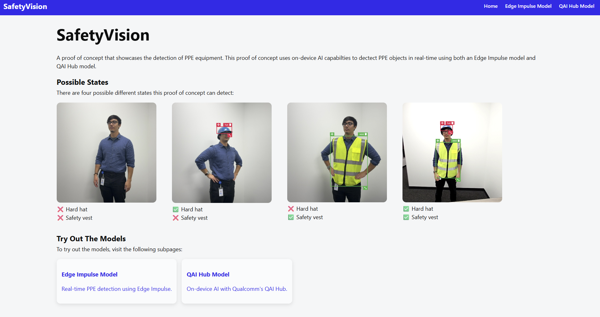
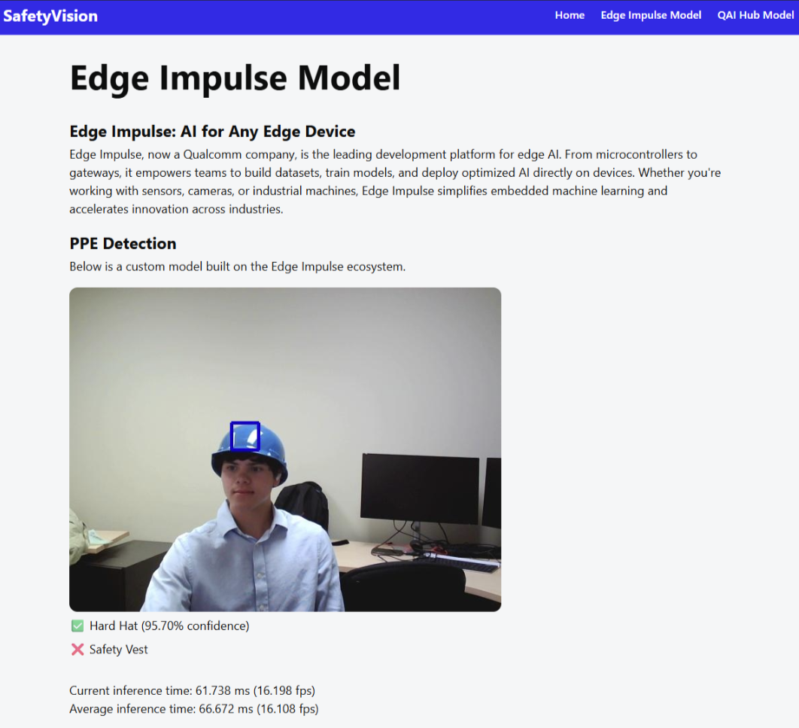

# SafetyVision: On-device Edge Impulse PPE Object Detection AI Model

A project that demonstrates the on-device AI capabilities of [Edge Impulse](https://edgeimpulse.com/) implemented on a [Rubik Pi 3 board](https://www.thundercomm.com/product/rubik-pi/) (Qualcomm Dragonwing™ QCS6490). Additionally, this project implements a simple pre-trained [QAI Hub PPE Detection model](https://aihub.qualcomm.com/iot/models/gear_guard_net) to showcase the differences between Edge Impulse and QAI Hub.

The object detection models have two classes (hard hat and safety vest) for a total of four possible states:

| State | Hard Hat | Safety Vest |
|-------|----------|-------------|
| 1     | ❌       | ❌          |
| 2     | ✅       | ❌          |
| 3     | ❌       | ✅          |
| 4     | ✅       | ✅          |

The webapp has a live feed of the external camera with box boundaries around all of the detected objects. Below the live feed is a list of detected items with their confidence as well as model inference speeds.

The home page:

The Edge Impulse inference page:

## Requirements
### Hardware
1. Rubik Pi 3 board
2. Power supply (12V 3A Type-C)
3. External USB Camera
4. Optional: RPI Cooler
    - Such as the [Raspberry Pi Raspberry Pi 5 Active Cooler - Aluminum Heatsink - SC1148](https://a.co/d/aFozNPB)
5. A device to connect to Rubik Pi's hosted webpage
    - For example, a smartphone

> [!WARNING]
> Without an RPi Cooler you risk a chance of overheating the board!

### Software

1. Flash an Ubuntu build onto the Rubik Pi 3 board
    - This project used an Ubuntu 24.04 build for the Qualcomm Dragonwing QCS6490 platform 
    - [Ubuntu on Qualcomm IoT Platforms](https://www.qualcomm.com/developer/software/ubuntu-on-qualcomm-iot-platforms) 
2. Connect the Rubik Pi 3 board to internet
3. On the Rubik Pi 3 board, make sure the following packages are installed by running the commands:
    - Update the package list and install available upgrades: `sudo apt-get update && sudo apt-get upgrade`
    - Python 3.12 and Pip and venv: `sudo apt-get install python3 python3-pip python3.12-venv`
        - For the Python websocket proxy
    - Node.js 22 and npm: `sudo apt-get install nodejs npm`
        - For the frontend
        - Note: to install Node.js 22 you may need to use [nvm](https://github.com/nvm-sh/nvm)
    - Edge Impulse CLI: `npm install edge-impulse-linux`
        - To download and run the edge impulse model on device
        - [More info](https://github.com/edgeimpulse/edge-impulse-linux-cli)
    - Qualcomm Neural Processing SDK for AI (QNN):
        - The SDK to utilize the on-device AI capabilities of the board
        - [More info](https://www.qualcomm.com/developer/software/neural-processing-sdk-for-ai)
        - Run the command: `sudo add-apt-repository ppa:carmel-team/noble --login`
        - Alternatively, download and install the following .deb files below:
            - libqnn-dev_2.34.0.250424-0ubuntu1_arm64.deb
            - libqnn1_2.34.0.250424-0ubuntu1_arm64.deb
            - libsnpe-dev_2.34.0.250424-0ubuntu1_arm64.deb
            - libsnpe1_2.34.0.250424-0ubuntu1_arm64.deb
            - qcom-fastrpc-dev_1.0.0-7_arm64.deb
            - qcom-fastrpc1_1.0.0-7_arm64.deb
            - qcom-libdmabufheap-dev_1.1.0+250131+rel1.0+nmu1_arm64.deb
            - qcom-libdmabufheap_1.1.0+250131+rel1.0+nmu1_arm64.deb
            - qnn-tools_2.34.0.250424-0ubuntu1_arm64.deb
            - snpe-tools_2.34.0.250424-0ubuntu1_arm64.deb
        - The .deb files can be found at:
            - https://launchpad.net/~ubuntu-qcom-iot/+archive/ubuntu/qcom-noble-ppa/+sourcepub/17395466/+listing-archive-extra
            - https://launchpad.net/~ubuntu-qcom-iot/+archive/ubuntu/qcom-noble-ppa/+sourcepub/17395465/+listing-archive-extra
            - https://launchpad.net/~ubuntu-qcom-iot/+archive/ubuntu/qcom-noble-ppa/+sourcepub/17214974/+listing-archive-extra
        - To install the downloaded .deb files, run this command in the directory with all the .deb files: `sudo dpkg -i *.deb`
4. Make sure to connect your account to the Edge Impulse CLI and select the proper project
    - [Clone the PPE detection model](https://studio.edgeimpulse.com/public/746098/latest) on Edge Impulse 
    - Run the command: `edge-impulse-linux`

## Installation Instructions

1. Make sure you have completed all the [Requirements](#requirements) above
2. Clone this Github Repository directly on the Rubik Pi 3 board
    - Use a command such as `git clone git@github.com:qualcomm/ppe-demo-for-edge-impulse-rpi.git`

## Usage

1. Make sure you have first followed the [Requirements](#requirements) and [Installation Instructions](#installation-instructions) steps above
2. Run the following command in the root directory of the repository: `python3 runner.py`
    - The runner.py script will automatically install all dependencies and start the demo. More info about the underlying project can be found below in the Technical Details section below
    - Note: The first time running the `runner.py` script will take some time to install all the Python and npm project dependencies
    - To stop the project, interrupt the running `runner.py` script by pressing `ctrl + c` (causing a keyboard Interrupt exception)
3. Access the hosted webpage via the local network IP address of the Rubik Pi at the port 3000
    - For example: http://10.0.0.31:3000

> [!NOTE]
> The Rubik Pi 3 and the device you are using to connect to the board must both be on the same local network! 

### System Architecture

    
Technical Details

    <h3>Sequence Diagram</h3>
    
    

        Above is a sequence diagram showcasing how the websocket requests are passed from the frontend to the backend and inference models back to the frontend.
    

    <h3>Frontend</h3>
    

      The frontend is implemented with a <a href="https://vite.dev/guide/" target="_blank">Vite React.js + Typescript</a>. The frontend acts as a client to the websocket backend.
    

    

        To run the frontend independently use the following command in the frontend folder: npm run dev -- --host
         The webpage will be accessible on the local network IP address of the Rubik Pi at the port 3000 (such as: http://10.0.0.31:3000). The website has an index page, Edge Impulse page (http://10.0.0.31:3000/edge-impulse), and QAI Hub page (http://10.0.0.31:3000/qai-hub).
    

    <h3>Backend</h3>
    

        The backend consists of a <a href="https://websockets.readthedocs.io/en/stable/index.html" target="_blank">Python websocket server</a> that acts as a proxy to communicate between the Rubik Pi 3's camera, on-device AI models, and frontend. 
    

    

        To run the backend independently use the following command in the backend folder: python3 main.py
         The websocket will be accessible on the local network IP address of the Rubik Pi at the port 8765 (such as: ws://10.0.0.31:8765). The webhook has two routes for each on-device model: ws://localhost:8765/edge-impulse and ws://localhost:8765/qai-hub.
    

    

        There is also the <a href="https://docs.edgeimpulse.com/docs/tools/edge-impulse-cli/cli-run-impulse" target="_blank">Edge Impulse Linux Runner</a> tool configured to use the QNN SDK to run on-device inference via an internal HTTP API server.
    

    

        To run the edge impulse runner independently use the following command: edge-impulse-linux-runner --enable-camera --force-target runner-linux-aarch64-qnn --force-engine tflite --force-variant int8 --run-http-server 8760
         The http server will be accessible on the local network IP address of the Rubik Pi at the port 8760 (such as: http://10.0.0.31:8760).
    

## License

This repository and project is licensed under the [BSD-3-clause License](https://spdx.org/licenses/BSD-3-Clause.html).
